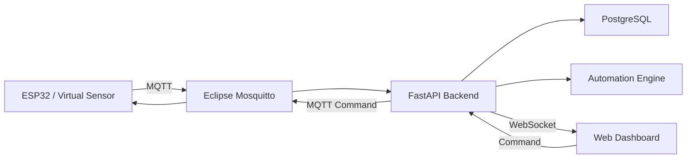

# 📡 PyIoT Command Center

<p align="center">
  <strong>แพลตฟอร์ม IoT สำหรับ Monitoring, Control และ Automation แบบ Real-time</strong>
</p>

<p align="center">
  พัฒนาด้วยแนวคิด <b>Python-first Full Stack Development</b><br>
  เพื่อเรียนรู้การสร้างระบบ IoT ตั้งแต่ Virtual Sensor ไปจนถึง ESP32 และ Production Deployment
</p>

<p align="center">
  
  
  
  
  
  
</p>

---

## 📖 เกี่ยวกับโปรเจกต์

**PyIoT Command Center** คือโปรเจกต์สำหรับพัฒนาแพลตฟอร์ม IoT ที่สามารถตรวจสอบสถานะอุปกรณ์ รับข้อมูลจาก Sensor ควบคุมอุปกรณ์ และสร้าง Automation Rule ผ่าน Web Dashboard ได้แบบ Real-time

โปรเจกต์นี้ถูกออกแบบให้พัฒนาแบบ **Incremental Development** โดยเริ่มจากระบบขนาดเล็กที่ใช้ Python จำลองอุปกรณ์ IoT ก่อน แล้วค่อยเพิ่ม MQTT, Backend API, Database, WebSocket, Hardware จริง และ Deployment ตามลำดับ

> 🎯 เป้าหมายหลักของโปรเจกต์คือการเรียนรู้ Full Stack Development โดยใช้ **Python เป็นแกนหลัก** และเข้าใจการออกแบบระบบ IoT ตั้งแต่ต้นจนจบ

---

## ✨ ความสามารถที่วางแผนไว้

- 🌡️ ตรวจสอบข้อมูล Temperature / Humidity แบบ Real-time
- 📟 จัดการและตรวจสอบสถานะ IoT Device
- 📊 แสดง Sensor History และกราฟย้อนหลัง
- ⚡ รับข้อมูล Telemetry ผ่าน MQTT
- 🎛️ ควบคุม Light / Fan / Relay จาก Web Dashboard
- 🔄 อัปเดตข้อมูลหน้าเว็บผ่าน WebSocket โดยไม่ต้อง Refresh
- 🤖 สร้าง Automation Rule แบบ `IF → THEN`
- 🚨 ระบบ Alert และ Event Log
- 🔐 Authentication และ Role-based Access Control
- 📡 รองรับ ESP32 และ Sensor จริง
- 🐳 รองรับ Docker และ Docker Compose
- 🚀 Deploy บน Home Server, Mini PC หรือ VPS

---

## 🏗️ System Architecture



### Data Flow

```text
Sensor / ESP32
      │
      │ Telemetry
      ▼
     MQTT
      │
      ▼
  Mosquitto
      │
      ▼
   FastAPI
      │
      ├────────► PostgreSQL
      │
      ├────────► Automation Engine
      │
      └────────► WebSocket
                     │
                     ▼
                 Web Browser
```

---

## 🧰 Tech Stack

### 🐍 Backend

| Technology | หน้าที่ |
|---|---|
| Python | ภาษาหลักของระบบ |
| FastAPI | REST API และ WebSocket |
| Pydantic | Data Validation |
| SQLAlchemy | ORM |
| Alembic | Database Migration |

### 📡 IoT & Real-time

| Technology | หน้าที่ |
|---|---|
| MQTT | โปรโตคอลสื่อสารระหว่าง Device และ Server |
| Eclipse Mosquitto | MQTT Broker |
| WebSocket | ส่งข้อมูลแบบ Real-time ไปยัง Browser |
| ESP32 | IoT Hardware |

### 🗄️ Database

| Technology | หน้าที่ |
|---|---|
| PostgreSQL | เก็บ Device, Telemetry, Event และ Automation |

### 🎨 Frontend

| Technology | หน้าที่ |
|---|---|
| HTML | โครงสร้างหน้าเว็บ |
| CSS | UI / Responsive Design |
| JavaScript | Interaction และ WebSocket |
| Chart.js | แสดงข้อมูล Sensor เป็นกราฟ |

### 🚀 Infrastructure

| Technology | หน้าที่ |
|---|---|
| Docker | Containerization |
| Docker Compose | รันหลาย Service |
| GitHub | Source Control / Repository |
| GitHub Desktop | Git Workflow |
| Visual Studio Code | Development Environment |

---

## 🗂️ Project Structure

```text
PyIoT-Command-Center/
│
├── AGENTS.md
├── README.md
├── requirements.txt
├── .env.example
├── .gitignore
│
├── backend/
│   └── __init__.py
│
├── simulator/
│   ├── __init__.py
│   ├── main.py
│   ├── device.py
│   ├── telemetry.py
│   └── sensors/
│       ├── __init__.py
│       ├── base.py
│       ├── temperature.py
│       └── humidity.py
│
├── frontend/
│   ├── css/
│   └── js/
│
├── tests/
│
├── scripts/
│
└── docs/
    ├── PROJECT_MAP.md
    ├── ARCHITECTURE.md
    ├── DEVELOPMENT.md
    └── COMMANDS.md
```

### หน้าที่ของแต่ละส่วน

| Folder / File | หน้าที่ |
|---|---|
| `AGENTS.md` | คำแนะนำสำหรับ AI Coding Agent เช่น Codex |
| `backend/` | FastAPI, API, Database, WebSocket และ Business Logic |
| `simulator/` | Virtual ESP32 และ Virtual Sensor |
| `frontend/` | HTML, CSS และ JavaScript Dashboard |
| `tests/` | Automated Tests |
| `scripts/` | Development / Maintenance Scripts |
| `docs/` | Architecture และ Documentation |
| `.env.example` | ตัวอย่าง Environment Variables |
| `requirements.txt` | Python Dependencies |

---

## 🗺️ Development Roadmap

| Phase | รายละเอียด | สถานะ |
|:---:|---|:---:|
| 01 | Project Foundation | ✅ |
| 02 | Virtual Sensor Simulator | 🚧 กำลังพัฒนา |
| 03 | MQTT Communication | ⏳ |
| 04 | FastAPI Backend | ⏳ |
| 05 | PostgreSQL & Data Model | ⏳ |
| 06 | Web Dashboard | ⏳ |
| 07 | Real-time WebSocket | ⏳ |
| 08 | Device Command & Control | ⏳ |
| 09 | Automation Rule Engine | ⏳ |
| 10 | ESP32 & Real Sensors | ⏳ |
| 11 | Authentication, Alert & Security | ⏳ |
| 12 | Docker, Testing & Deployment | ⏳ |

### 🎯 เป้าหมาย Version 1.0

```text
ESP32 / Virtual Sensor
          ↓
        MQTT
          ↓
      Mosquitto
          ↓
       FastAPI
          ↓
   ┌──────┼──────────┐
   ↓      ↓          ↓
Database  Automation  WebSocket
                       ↓
                   Dashboard
```

---

## 🚀 เริ่มต้นพัฒนา

### 1. Clone Repository

```cmd
git clone <repository-url>
cd PyIoT-Command-Center
```

### 2. สร้าง Python Virtual Environment

```cmd
python -m venv .venv
```

### 3. Activate Virtual Environment

สำหรับ **Windows CMD**

```cmd
.venv\Scripts\activate
```

เมื่อสำเร็จจะเห็นประมาณนี้

```text
(.venv) C:\Path\To\PyIoT-Command-Center>
```

### 4. ติดตั้ง Dependencies

```cmd
python -m pip install -r requirements.txt
```

### 5. เปิดโปรเจกต์ด้วย VS Code

```cmd
code .
```

### 6. รัน Simulator

```cmd
python simulator\main.py
```

Simulator มีอุปกรณ์จำลอง 10 เครื่อง รหัส ESP32-ROOM-001 ถึง ESP32-ROOM-010
ในแต่ละรอบจะแสดง JSON ครบทั้ง 10 เครื่อง แล้วรอประมาณ 2 วินาทีก่อนเริ่มรอบใหม่
ตัวอย่างข้อมูลจากหนึ่งเครื่อง:

```json
{
    "device_id": "ESP32-ROOM-001",
    "temperature": 30.12,
    "humidity": 65.34,
    "timestamp": "2026-09-09T18:29:08.576066+00:00"
}
```

ค่าอุณหภูมิ ความชื้น และเวลาจะเปลี่ยนไปในแต่ละรอบ กด `Ctrl+C` เมื่อต้องการหยุด Simulator

---

## ⚙️ Environment Variables

สร้างไฟล์ `.env` จาก `.env.example`

ตัวอย่าง:

```env
APP_NAME=PyIoT Command Center
APP_ENV=development

MQTT_HOST=localhost
MQTT_PORT=1883

DATABASE_HOST=localhost
DATABASE_PORT=5432
```

> ⚠️ ห้าม Commit ไฟล์ `.env` หรือ Credential จริงขึ้น Repository

---

## 🤖 การใช้งานร่วมกับ Codex

โปรเจกต์นี้ใช้ `AGENTS.md` และเอกสารใน `docs/` เพื่อช่วยให้ Codex เข้าใจ Codebase และ Architecture

ก่อนแก้ไขงานสำคัญ Codex ควรอ่าน:

```text
AGENTS.md
      │
      ├── docs/PROJECT_MAP.md
      ├── docs/ARCHITECTURE.md
      └── docs/DEVELOPMENT.md
```

หลักการสำคัญ:

- ไม่เพิ่ม Technology จาก Phase อนาคตโดยไม่ได้รับคำสั่ง
- อ่าน Code เดิมก่อนสร้าง Module ใหม่
- หลีกเลี่ยงการ Refactor ส่วนที่ไม่เกี่ยวข้อง
- ไม่ Hardcode Password, Token หรือ Secret
- อัปเดต Documentation เมื่อ Architecture เปลี่ยน
- Run Test หลังแก้ไข Code เมื่อมี Test รองรับ

---

## 🧪 Development Workflow

Workflow ที่แนะนำสำหรับแต่ละ Feature:

```text
Requirement
    ↓
Design
    ↓
Implement
    ↓
Test
    ↓
Code Review
    ↓
Refactor
    ↓
Git Commit
    ↓
Documentation
```

ตัวอย่าง Commit Message:

```text
feat: add virtual temperature sensor
fix: handle mqtt reconnect
refactor: separate device service
test: add sensor simulator tests
docs: update architecture
```

---

## 📌 Current Development Status

```text
┌──────────────────────────────────┐
│                                  │
│     PyIoT Command Center         │
│                                  │
│     Current Phase: 02            │
│     Virtual Sensor Simulator 🚧  │
│                                  │
└──────────────────────────────────┘
```

สถานะปัจจุบัน:

- [x] Project structure
- [x] Python virtual environment
- [x] Git repository
- [x] Phase 1 documentation
- [x] Temperature และ Humidity Sensor จำลอง
- [x] Virtual Device และ Telemetry พร้อมเวลา UTC
- [x] แสดงข้อมูลเป็น JSON ทุก 2 วินาที
- [x] Automated tests สำหรับ Simulator (10 tests)
- [x] Phase 2 Review

---

## 🎓 สิ่งที่ต้องการเรียนรู้จากโปรเจกต์นี้

โปรเจกต์นี้ไม่ได้มีเป้าหมายเพียงแค่สร้าง IoT Dashboard แต่ใช้เป็นสนามฝึกสำหรับ:

- Python Software Development
- Full Stack Development
- REST API Design
- Database Design
- Real-time Communication
- Event-driven Architecture
- MQTT
- IoT Device Communication
- Automation System
- Authentication & Security
- Testing
- Docker
- Deployment
- Git / GitHub Workflow
- Software Architecture

---

## 📜 License

โปรเจกต์นี้อยู่ระหว่างการพัฒนาและยังไม่ได้กำหนด License อย่างเป็นทางการ

---

<p align="center">
  <strong>Built with 🐍 Python, 📡 IoT and a lot of learning.</strong>
</p>

<p align="center">
  <sub>PyIoT Command Center — From Virtual Sensor to Real-world IoT Platform</sub>
</p>
